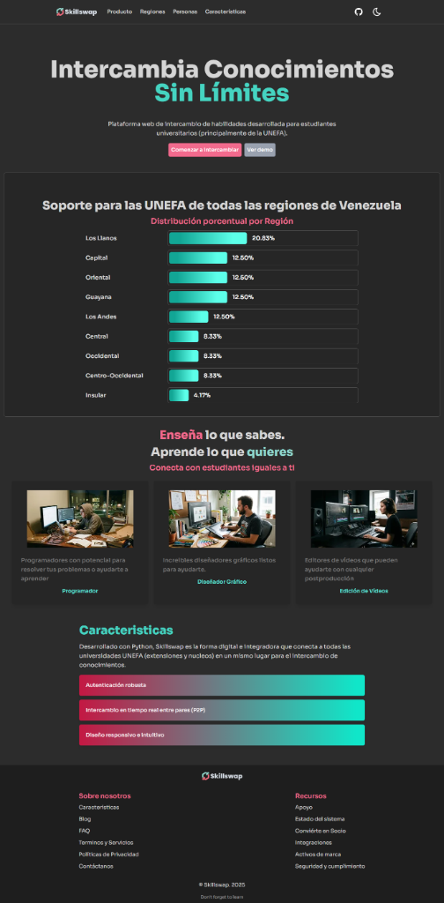
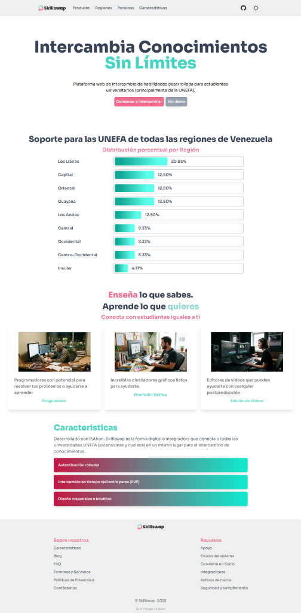

# Skillswap - Landing Page

Plataforma web de intercambio de habilidades desarrollada para estudiantes universitarios (principalmente de la UNEFA). 

Esta es la *landing page* oficial del proyecto, diseñada para presentar las características de la plataforma, que permite a los estudiantes enseñar lo que saben y aprender lo que necesitan conectando con otros compañeros.

## Stack Tecnológico

Este repositorio contiene la web estática, construida con las siguientes tecnologías:

- **Framework:** [Astro](https://astro.build/)
- **Estilos:** [Tailwind CSS](https://tailwindcss.com/)
- **Iconos:** Astro Icon
- **Gestor de paquetes:** pnpm

## Vistas Previas

### Modo Oscuro


### Modo Claro


## Instalación y Ejecución Local

Sigue estos pasos para correr la landing page en tu computadora:

1. Clona el repositorio:
   ```bash
   git clone git@github.com:OriC28/Skillswap_LandingPage.git
   ```

2. Instala las dependencias (recomendado usar `pnpm`):
   ```bash
   pnpm install
   ```

3. Inicia el servidor de desarrollo:
   ```bash
   pnpm run dev
   ```

4. Abre tu navegador en `http://localhost:4321` para ver la página.

---
*Intercambia Conocimientos Sin Límites*
